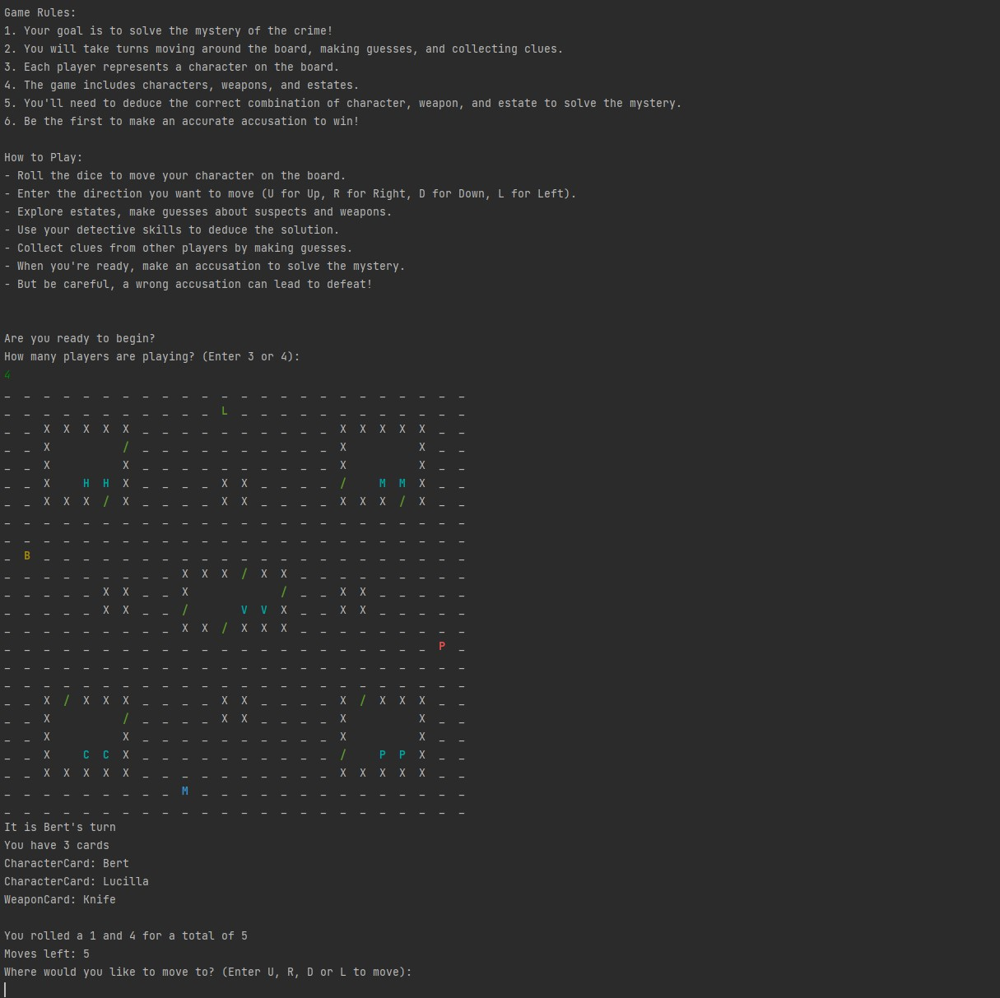
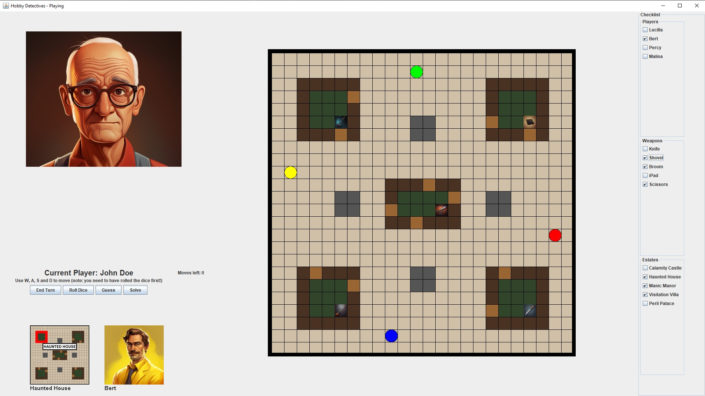

# Hobby Detectives - Java-based Cluedo-Inspired Game

Hobby Detectives is a group project that brings the classic mystery-solving fun of Cluedo to the digital world. Built entirely in Java, this game features both text-based and GUI interfaces using JSwing, providing players with an engaging and interactive gaming experience. Through the implementation of software design principles such as CRC cards, UML diagrams, state diagrams, and MVC architecture, Hobby Detectives showcases a well-structured and thoughtfully designed codebase.

## Table of Contents

- [Game Overview](#game-overview)
- [Features](#features)
- [Screenshots](#screenshots)
- [Installation and Usage](#installation-and-usage)
- [Software Design Principles](#software-design-principles)
- [Contributors](#contributors)

## Game Overview

In Hobby Detectives, players step into the shoes of amateur sleuths trying to solve a thrilling mystery. The game is inspired by the classic board game Cluedo, where players must deduce the suspect, weapon, and location of a crime. Hobby Detectives brings this concept to the digital realm, enhancing it with captivating graphics and a user-friendly interface.

## Features

- Text-based and GUI interfaces to cater to different player preferences.
- A range of characters, weapons, and estates to keep the mystery fresh and exciting.
- Intuitive controls and user-friendly interactions for a smooth gameplay experience.
- Rich graphics and visual cues to immerse players in the detective world.
- In-game notepad for players to jot down clues and track deductions.
- Implementation of key software design principles:
  - CRC cards for class responsibilities and collaborations.
  - UML diagrams to visualize the class structure and relationships.
  - State diagrams to model the game's different states and transitions.
  - MVC architecture to separate concerns and ensure maintainability.

## Screenshots

*Figure 1: Text-based interface showcasing gameplay.*

*Figure 2: GUI interface providing a visual representation of the game board.*

## Installation and Usage

1. Clone the repository: `git clone https://github.com/your-username/hobby-detectives.git`
2. Navigate to the project directory: `cd hobby-detectives`
3. Compile the Java code: `javac HobbyDetectives.java`
4. Run the game: `java HobbyDetectives`
5. Follow the on-screen instructions to play the game.

## Software Design Principles

Hobby Detectives demonstrates the effective application of several software design principles:

- **CRC Cards:** Collaborative design using Class-Responsibility-Collaboration cards ensured a clear understanding of each class's role and interactions.

- **UML Diagrams:** Unified Modeling Language diagrams were employed to visualize the class structure, relationships, and inheritance hierarchies within the project.

- **State Diagrams:** State diagrams helped model the various states of the game, from player turns to solving the mystery, enhancing the overall game flow.

- **MVC Architecture:** The Model-View-Controller architecture was followed to separate the game's logic (Model), user interface (View), and user interactions (Controller), facilitating modularity and maintainability.

## Contributors

- Tokeley ([@tokeley](https://github.com/tokeley))
- SlazengerV100 ([@slazengerv100](https://github.com/slazengerv100))
- MathiasSCode ([@mathiasscode](https://github.com/mathiasscode))

---

Get ready to unravel a captivating mystery with Hobby Detectives! Whether you're a fan of Cluedo or simply enjoy solving puzzles, this Java-based game will keep you engaged for hours. Have fun deducing suspects, weapons, and estates while appreciating the power of software design principles in action.
